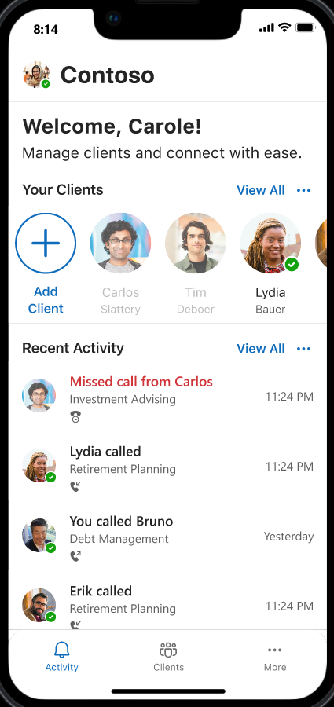
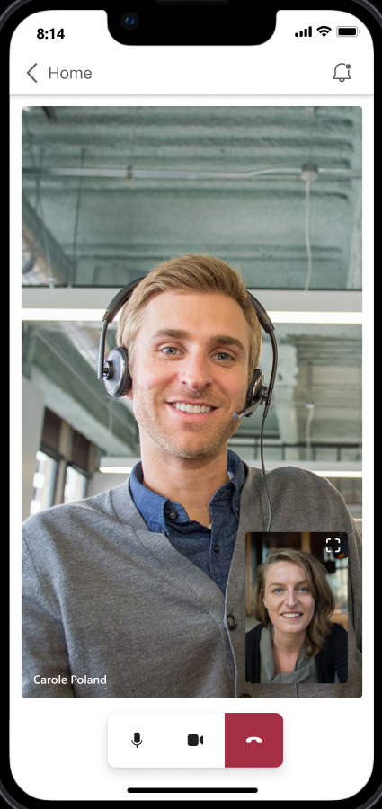

# Creating a Cross-platform Demo App using ACS Calling SDK

**Course:** CPEN 491 Capstone Design Project  
**Team PB-54:** Buland Choudhary, Gurjas Singh Oberoi, Illya Vekslyer, Rebecca Lee  
**Client:** Azure Communication Services  
---

## UI

**Screenshots:**

### 1. Role Selection

### 2. Advisor Home Screen

### 3. Client Onboarding Screen

### 4. Client Home Screen

### 5. Client-Investment Dashboard

### 6. Client-Advisor Video Call

### 7. Copilot Summary View (Advisor)

---
## Project Background

- **Problem Statement:**  
  ACS needs a reference mobile app that demonstrates their Calling SDK for secure video calls in financial-institution scenarios.  
- **Goals:**  
  - Showcase ACS Calling SDK capabilities to prospective enterprise clients.  
  - Reduce adoption friction by providing a turnkey demo.  
  - Integrate Copilot AI to auto-summarize call conversations.  

---

## System Overview

1. **Frontend (React Native Mobile App):**  
   - Manages UI, ACS CallComposite, Copilot integration.  
2. **Backend (Azure Functions):**  
   - Exposes RESTful APIs for user, pairing, calls, summaries.  
3. **Database (Azure PostgreSQL):**  
   - Stores users, pairings, call logs, tokens.  
4. **Notification Hub (Azure Notification Hubs):**  
   - Push notifications (FCM/APNS) for incoming calls.  

---
## Scope & Requirements

### Functional Requirements

1. **Video Calling** using ACS SDK (React Native).  
2. **Secure User Signup/Login** with roles: Client or Advisor.  
3. **Role-Based Dashboards** (Client vs. Advisor).  
4. **Copilot Summaries:** Post-call conversational summaries via Azure Copilot AI.  

### Non-Functional Requirements

- **Usability:** Intuitive, responsive interface; key actions ≤ 3 taps.  
- **Portability:** Cross-platform support (Android 11+, iOS 14+).  
- **Security:** Encrypted storage & communications; JWT tokens.  
- **Performance:** Call interface loads within 2 seconds.  

### Constraints

- Must comply with ACS Calling SDK usage guidelines.  
- Consistent Microsoft-style UI language.  

---

## Detailed Design

### Frontend (Mobile App)

- **Screens & Flows:**  
  1. **Login/Signup** (Microsoft OAuth).  
  2. **Role Selection** (Client or Advisor).  
  3. **Pairing** (6-digit code exchange).  
  4. **Call Interface:** Mute, video toggle, end call.  
  5. **Copilot Summary View.**  
- **Technologies:**  
  - React Native, ACS SDK (CallComposite).  
  - React Navigation, Context API.

## Backend & APIs

**Modules:**
- **User Management:** `/users/*`
- **Pairing:** `/pairings/*`
- **Calling:** `/calls/*`
- **Copilot Summaries:** `/summaries/*`

## Database Schema

| Table                     | Key Columns                                                      |
|---------------------------|------------------------------------------------------------------|
| **Users**                 | `userID (UUID)`, `email`, `role`                                 |
| **Advisor_Pairing_Codes** | `advisorID (PK)`, `pairingCode (CHAR(6))`                       |
| **Advisor_Client_Pairs**  | `clientID`, `advisorID` (composite PK)                           |
| **Calls**                 | `groupID (UUID)`, `callerID`, `calleeID`, `status`, `startTime`, `endTime` |
| **Copilot_Summaries**     | `callID (FK)`, `summaryText`, `createdAt`                        |

## Notification System

**Flow:**
1. Backend receives `createCall` → generates `groupID`.
2. Calls Azure Notification Hubs → sends FCM/APNS.
3. Mobile OS displays incoming-call UI.

**Reliability:** Logs and retries, async processing.

